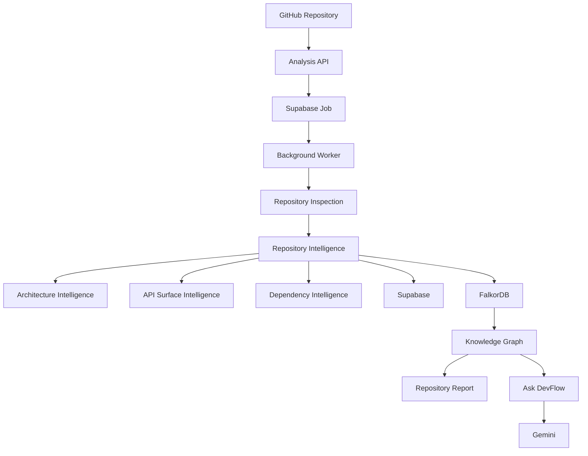

# DevFlow

Turn an unfamiliar GitHub repository into an interactive engineering map.

- **Live Demo:** [DevFlow App](https://ais-pre-zcx2yle33cjlarz6q3w7ye-236135050293.asia-southeast1.run.app)
- **GitHub Repository:** [GitHub Repository](https://github.com/eko-dev/devflow)
- **Hackathon:** WeMakeDevs × Zerops

---

## The Problem

Understanding an unfamiliar repository requires manually exploring and cross-referencing:
- README files and fragmented documentation
- Package manifests across monorepo packages and subdirectories
- Directory structures, entry points, and routing modules
- Core services, API endpoints, and middleware layers
- External dependencies and architecture boundaries

This manual overhead becomes overwhelming when onboarding to large codebases, evaluating open-source libraries, or exploring unfamiliar tech stacks with sparse documentation.

---

## The Solution

DevFlow automates repository comprehension by turning raw source code into structured engineering intelligence and interactive architectural maps.

```
GitHub Repository
        ↓
Analysis Job
        ↓
Repository Inspection
        ↓
Repository Intelligence
        ↓
Architecture + API Analysis
        ↓
FalkorDB Knowledge Graph
        ↓
Interactive Repository Report
        ↓
Ask DevFlow
```

1. **Deterministic Extraction**: DevFlow clones and statically inspects the codebase to extract exact facts about languages, frameworks, dependencies, package managers, and API routes without relying on ungrounded AI guesses.
2. **Knowledge Graph Projection**: Extracted facts and structural relationships are projected into a **FalkorDB** graph database.
3. **Graph-Grounded Q&A ("Ask DevFlow")**: When users ask questions about the repository, DevFlow queries the FalkorDB knowledge graph for exact factual context before passing it to Gemini, ensuring precise, grounded answers rather than generic hallucinations.

---

## What DevFlow Provides

- **Repository Intelligence**: Comprehensive breakdown of repository purpose, structure, and classification.
- **Language & Framework Detection**: Extension mapping and framework identification with confidence scoring.
- **Dependency Intelligence**: Multi-manifest manifest parsing for Node.js, Python, Rust, Go, Java, and more.
- **Architecture Intelligence**: Workspace layout analysis, decoupled client/server inspection, and containerization detection.
- **API Surface Intelligence**: Automated route detection across controllers, handlers, and API endpoints.
- **Repository Health Signals**: Evaluation of CI workflows, Docker setups, and standard project configuration files.
- **Interactive Architecture Visualization**: Dynamic visual maps powered by D3.
- **FalkorDB Knowledge Graph**: Robust graph-based entity and relationship storage.
- **Graph-Grounded AI Questions**: Context-aware querying via Gemini backed by real graph facts.
- **Asynchronous Repository Analysis**: Robust background worker architecture managing job state transitions.
- **Analysis Progress Tracking**: Real-time state updates across queued, running, completed, and failed stages.

---

## How It Works



---

## Local Development & Setup

```bash
# Install workspace dependencies with pnpm
pnpm install --frozen-lockfile

# Start full-stack development server (API + Web on Port 3000)
pnpm run dev

# Start background analysis worker
pnpm run worker

# Run typecheck across all workspace packages
pnpm run lint

# Run unit tests
pnpm test

# Build production bundle
pnpm run build
```

---

## Production Deployment (Zerops)

DevFlow is fully configured for zero-downtime, multi-service deployment on **Zerops** using `zerops.yaml`:
- **`frontend`**: Static SPA deployment powered by Vite.
- **`api`**: Node.js 22 Express API server handling analysis endpoints and health checks (`GET /health`).
- **`worker`**: Background Node.js 22 job processing daemon.
